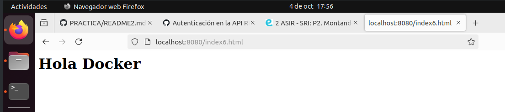

#PRACTICA 2 SRI
## Comproba que a tes a imaxe httpd
Utilizando el comando `** docker images**` listamos las imagenes y comprabamos que tenemos una imagen httpd.

## Crea un contenedor de nome 'asir_httpd'.

## Mapea o porto 80 do contenedor có 8080 da túa máquina. Utiliza bind mount para que o directorio do apache2 'htdocs' estea montado nun directorio da túa elección.

Utilizando el comando `**docker run --name asir_httpd -d -p 8080:80 -v "$PWD"/htdocs:/usr/local/apache2/htdocs/ httpd**` se creara el contenedor y a su vez se va a mapear. 
Este comando incia un servidor apache en un contenedor docker, accesible desde el puerto 8080, y utiliza nuestro servidor local para servir los archivos.

## Mostra unha páxina html aloxada no apache2 dende o teu navegador.

Para mostars la pagina html creada abrimos el navegador y colocamos `**http:localhost:8080**` y nos mostrara el html creado.
<picture>  <source media="(nombre)" srcset=""> </picture>

## Crea un contenedor 'asir_web1' que use este mesmo directorio para 'htdocs' e o puerto 8000

## Crea outro contenedor 'asir_web2' có el mesmo directorio e otro puerto, como o 8090. Comproba que los dous servidores mostran a mesma páxina